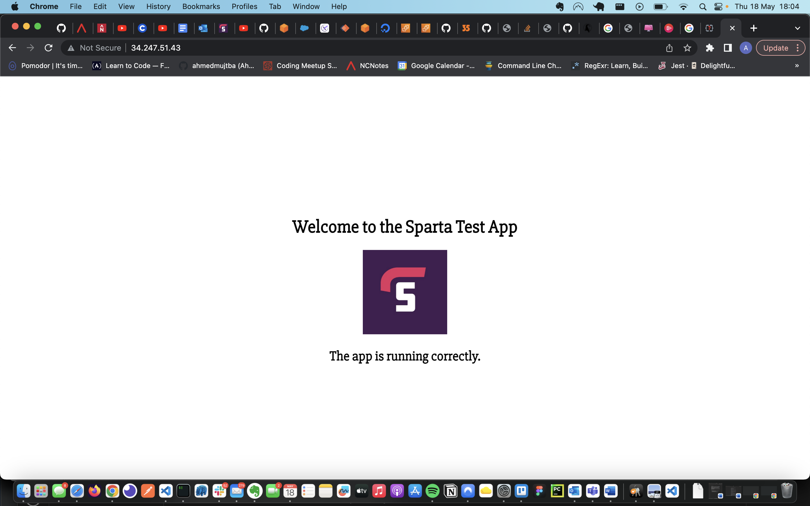

# Automating reverse proxy in app bash

##

1. Create a SSH connection for your app instance using the command from AWS. It should look like this:

- `ssh -i "tech230.pem" ubuntu@ec2-34-247-51-43.eu-west-1.compute.amazonaws.com`

2. Create a provision file for your app with the command:

- `sudo nano app-provision.sh`

3. From your previous provisioning when app was deployed through vagrant, obtain the following shell script and paste this into the provision file within shell. This script should look like this:

#!/bin/bash

`sudo apt-get update -y`

`sudo apt-get upgrade -y`

`sudo apt-get install nginx -y`

`sudo nano /etc/nginx/sites-available/default`

`sed -i 's+try_files $uri $uri/ =404;+proxy_pass http://localhost:3000/;' app-provision.sh`

`sudo nginx -t`

`sudo systemctl restart nginx`

`sudo apt-get install git -y`

`curl -sL https://deb.nodesource.com/setup_12.x | sudo -E bash -`

`sudo apt-get install nodejs -y`

`npm install pm2 -g`

`cd app`

`npm install`

`npm start`

4. Run the provison file using the command `./app-provision-sh`. If an error appears related to permissions, run `sudo chmod a+rwx /.app-provison.sh`

5. Now run the provison file, if successful it should output:

`Your app is ready and listening on port 3000`

6. Copy the IPv4 address from your app AMI and paste in the browser, you can see the app is working if your webpage looks like this:

