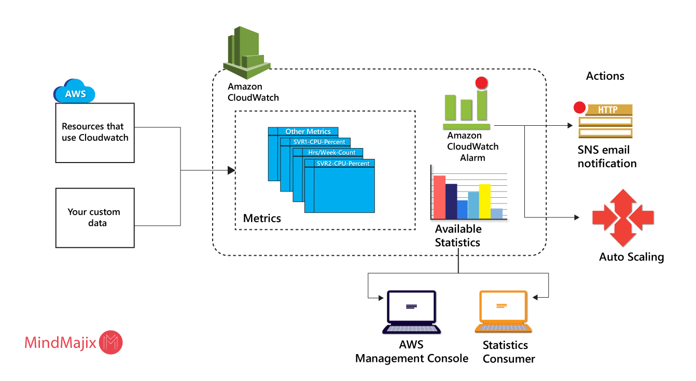
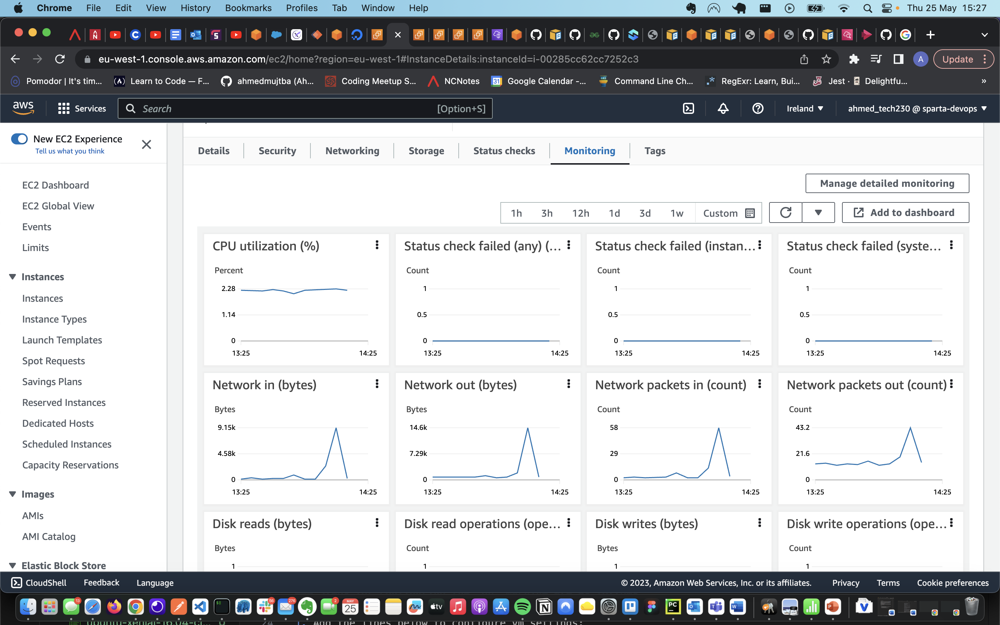
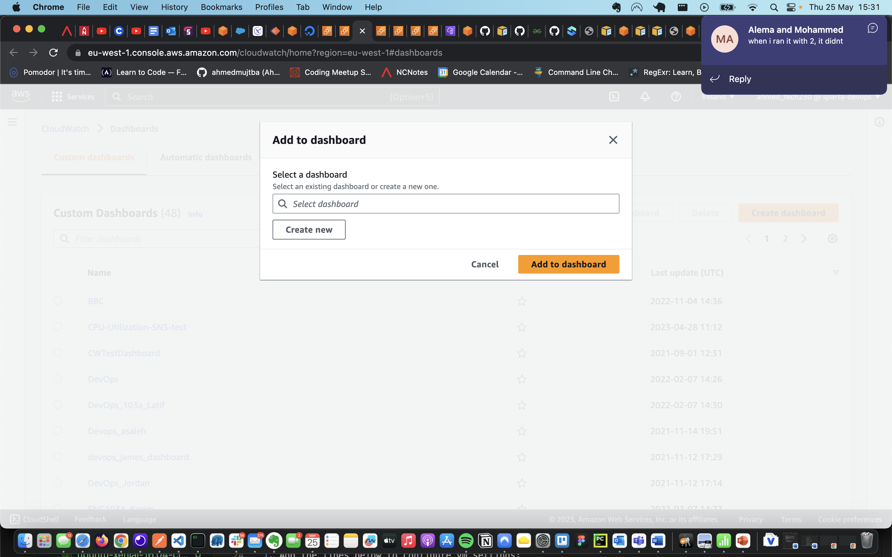
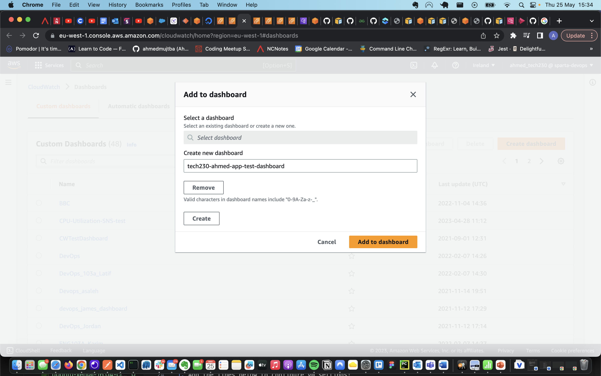
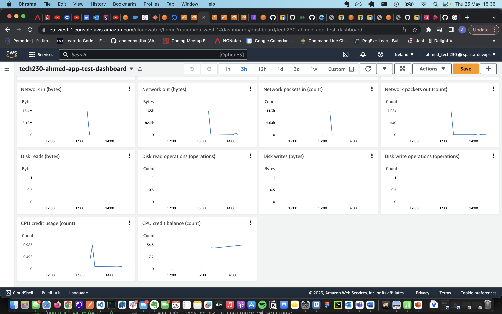
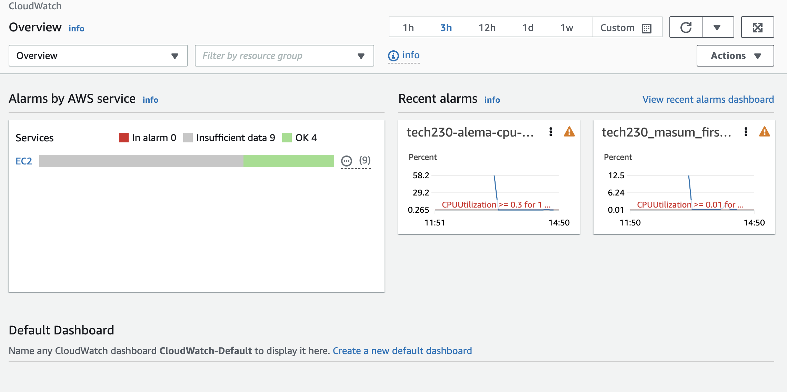
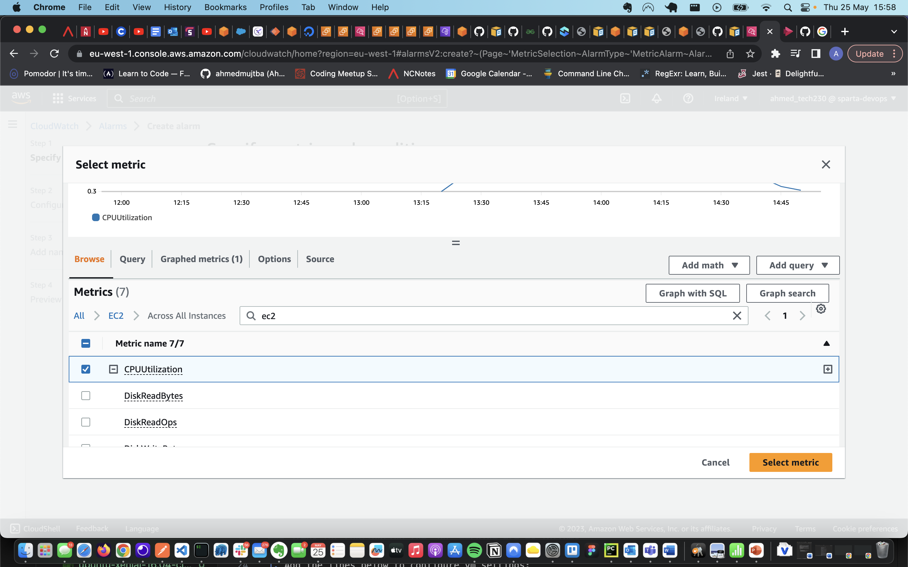
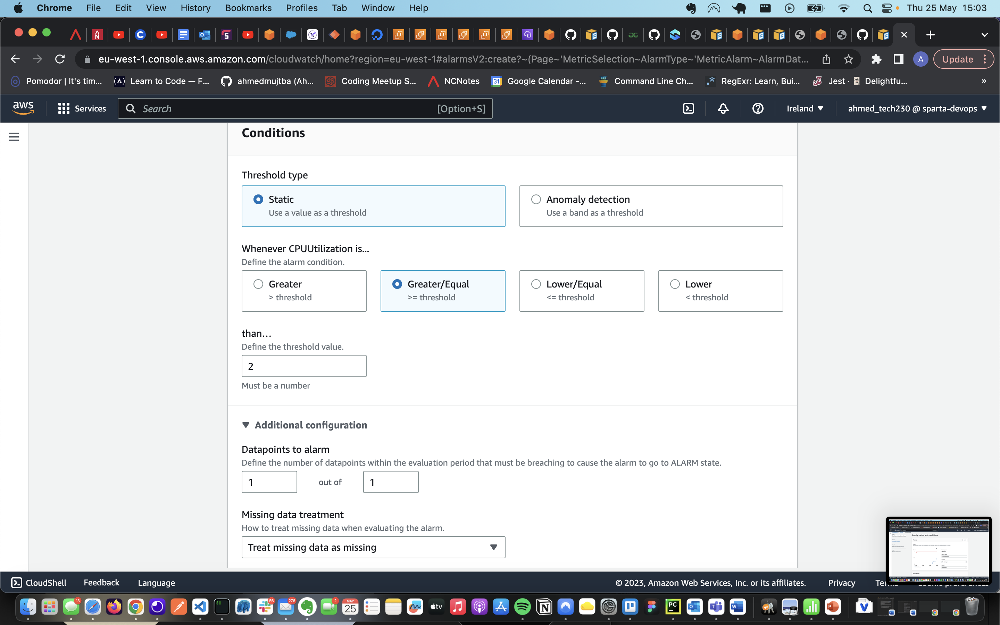
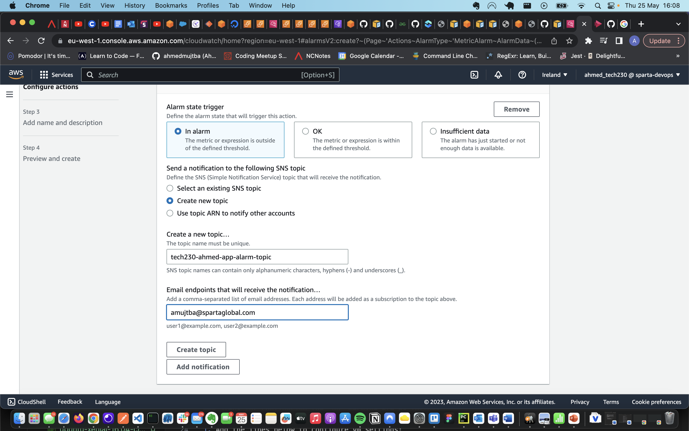

# Cloudwatch, Dashboard and CPU Utilization Alarm

In this doc, we'll have a look at how to setup cloudwatch, a monitoring dashboard and setting up an alarm based on CPU utilization for our App EC2 instance.

## Cloudwatch

## Creating a Monitoring Dashboard

To create a dashboard you are required to have created an EC2 instance already. Once you have that completed follow the steps as follows:

1. Go to the instance dashboard by clicking on the `instance ID` and scroll down to the monitoring tab:

2. click `Add to dashboard`. This should open up a new browser window like the one below:

3. Click on `Add new`, name it appropriately and click `Create`. Name will be added to the dashboard name section and you can now click `Add to dashboard`. This should look like this:

4. You'll know your dashboard is created when your screen proceeds to show you `CPU credit usage` and `CPU credit balance` like below:

## Creating a CPU Utilization Alarm

To set up a CPU utilization alarm for EC2 instances, we can follow the steps as follows:

1. Open the CloudWatch console at https://console.aws.amazon.com/cloudwatch/. This should show an overview of the Cloudwatch and you should be able to `All Alarms` option from the left hand menu.

2. In the left menu, choose Alarms, `All Alarms`.
3. Choose `Create alarm`.
4. Choose `Select metric` and in the All metrics tab, search EC2 metrics and choose `Across All Instances` and then from the options that show, select `CPUUtilization` option as below:

5. Under Specify metric and conditions, for Statistic choose Average, choose one of the predefined percentiles, or specify a custom percentile like below:

6. In configure actions section, create a new topic with an appropirate name and email you will like the notifications to be sent to (see below). You can now proceed to clicking `Create topic` and then `Next`

7. Name your alarm in the `Name and description` section, proceed to preview and then click `Create Alarm`
