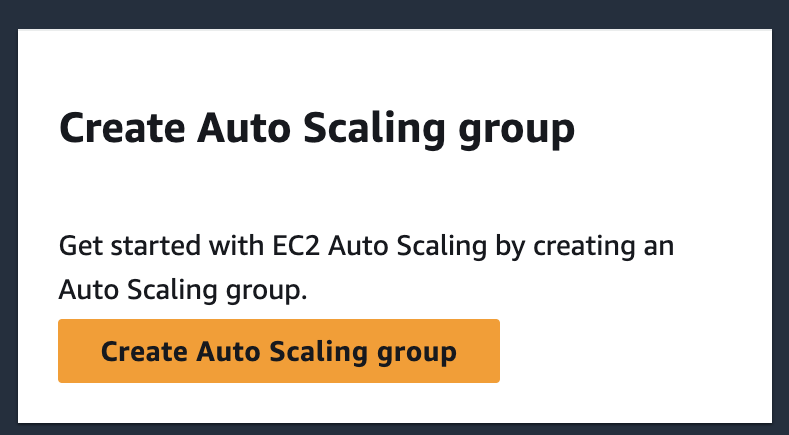
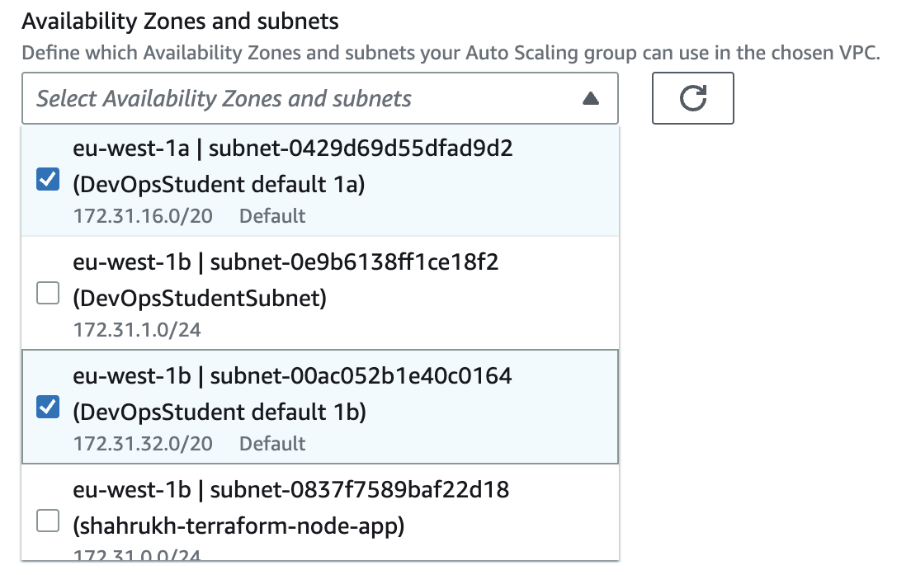
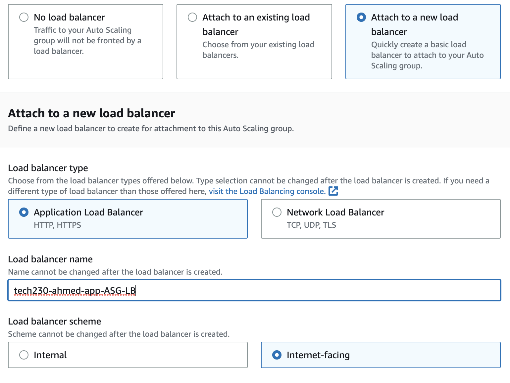
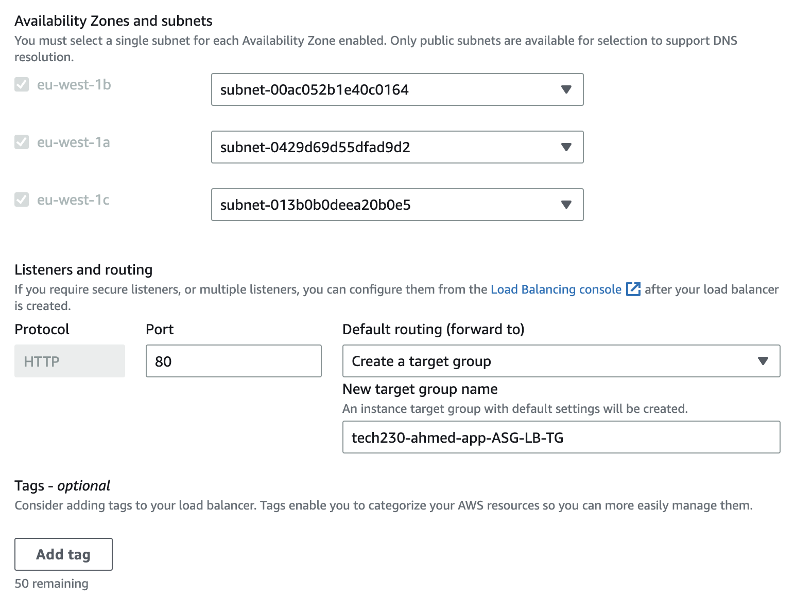
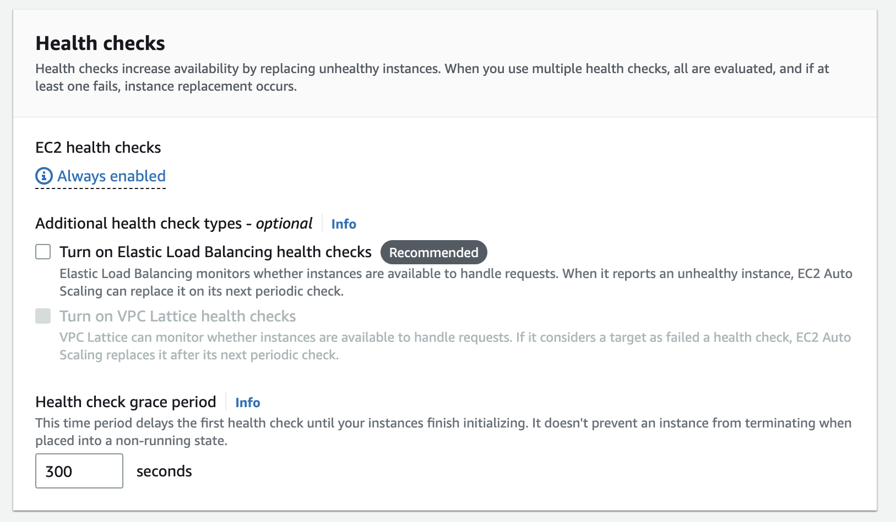
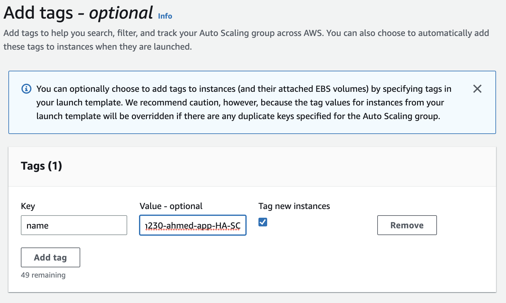

# How to create an autoscaling group for the sparta app.

Follow the steps below to create an autoscaling group for the Sparta App Page.

## Ground Work before ASG is created

1. Create an EC2 instane for the app titled 'tech230-ahmed-app'

- Go to `instances` and select `launch instance`.
- Name it `tech230-ahmed-app`
- Select Ubuntu Server 18.04 for your Application and OS images
- Select `t2.micro` as your instance type
- Select `tech230` as your key pair (login).
- Select relevant existing security group in the Network Settings section.
- In Advanced details you'll need to add user data. This should be the same as a working version of your app provision script.
- Click `Launch Instance` when ready.

2. Create an AMI for the app titled 'tech230-ahmed-app-AMI'

- On instance summary page, Select `Actions` dropdown and within `Image and Templates`, select `Create Image`.
- Name your AMI as `tech230-ahmed-app-AMI`
- Select `Create Image`

3. Create a template for the app titled 'tech230-ahmed-app-template'

- Go to `Launch Templates` section from the menu shown on the left hand side.
- Select `Create Launch Template`
- Name your template as `tech230-ahmed-app-TMP`
- Select your AMI and instance type (`t2.micro`)
- Select `tech230` as your key pair (login).
- Select relevant existing security group in the Network Settings section.
- In Advanced details you'll need to add user data. This should be the same as a working version of your app provision script.
- Select `Create Launch Template` when ready

## Creating ASG

You can now create your ASG from the EC2 dashboard by clicking `Create Auto Scaling Group`
This should look like below:

1. Name your ASG as `tech230-ahmed-app-ASG`
2. Select a launch template for the ASG, This should be same as the one created in the groundwork completed above.
3. In the instance launch options, select your `Availability Zones` as `DevOps Student Default 1a, DevOps Student Default 1b and DevOps Student Default 1c`, see below:

4. In the `instance type requirements` section, double check that the instance type appears as `t2.micro`

5. Load balancing, Select the `attach to a new load balancer` option and define your load balancer as follows:

You'll also need to create a target group in this section like below:

6. Now move on to the `health check` section and tick the box showing `Turn on Elastic Load Balancing health checks` as follows:

7. Configure the group size as follows:

8. In the next section, select `target tracking scaling policy` and set `name`, `metric type` and `desired value` as shown below:

9. Ignore the `add notifications section` for now.
10. In the `Add tags` section, add a tag titled `name` and name it `tech230-ahmed-app-HA-SC`:

11. In the review section, make sure all the options are correct and click on `Create Auto Scaling Group` to create your ASG.
