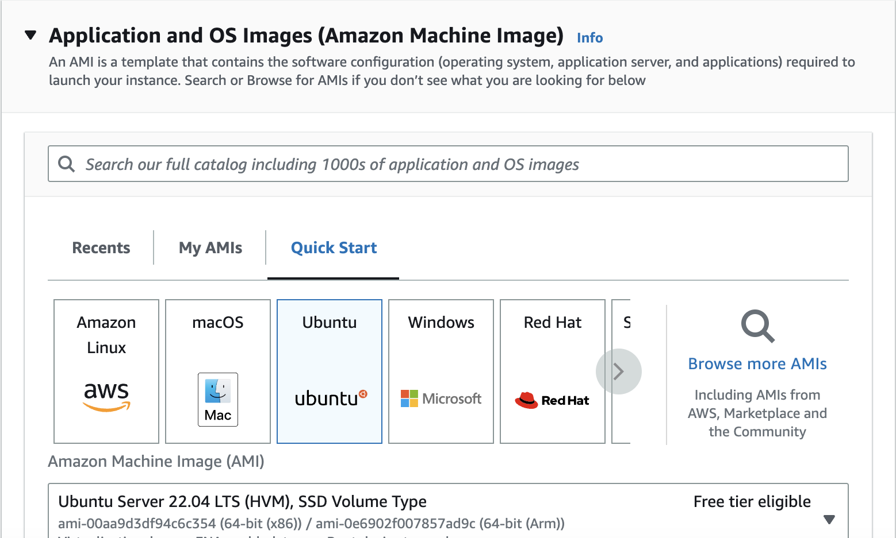

# A guide on how to create a EC2 instance in AWS

## AWS EC2 setup

1. Login to AWS using your `Username` and `Password`. Your screen should look like this:

2. Make sure your location appears as `Ireland` as it appears on the top irght hand corner in the picture above.
3. In the search bar, search for `EC2` and click the option as shown below:

4. Click on `Launch Instance`. This should look like this:

5. Name and tags - Name your instance using the format `tech230_name_first_ec2`.
6. Application & OS Images - Select your system as `ubuntu`. from the options shown.
7. Change your server to `20.04` and make sure it's `free tier eligible` as shown below:

Steps 6 & 7 should look like this:

8. Instance type - Select your instance type as `t2.micro` and again make sure it's `free tier eligible`
9. Name your key pair option as `tech_230`
10. Network Settings - Nothing to be changed here
11. Configure Storage - Nothing to be changed here
12. Select `launch instance` on the screen to launch your instance

## Now that your instance is created, you'll need to connect using a SSH connection

1. In terminal, run `chmod 400 tech230.pem` - To make tech30 key read only
2. Run the command provided by AWS when you click 'Connect'. It should look like this:
   `ssh -i "tech230.pem" ubuntu@ec2-52-19-32-215.eu-west-1.compute.amazonaws.com`.

## Setup NGINX server

1. Run the following commands in this order:

`sudo apt update -y`
`sudo apt upgrade -y`
`sudo apt install nginx -y`
`sudo systemctl start nginx`
`sudo systemctl enable nginx`
`sudo systemctl status nginx`

2. Change security group to add a new rule to allow HTTP/S in addition to SSH so we are able to access our nginx server using public IP.

3. Copy and paste the public IPv4 address in your web browser, you can view this on the page as shown below:

