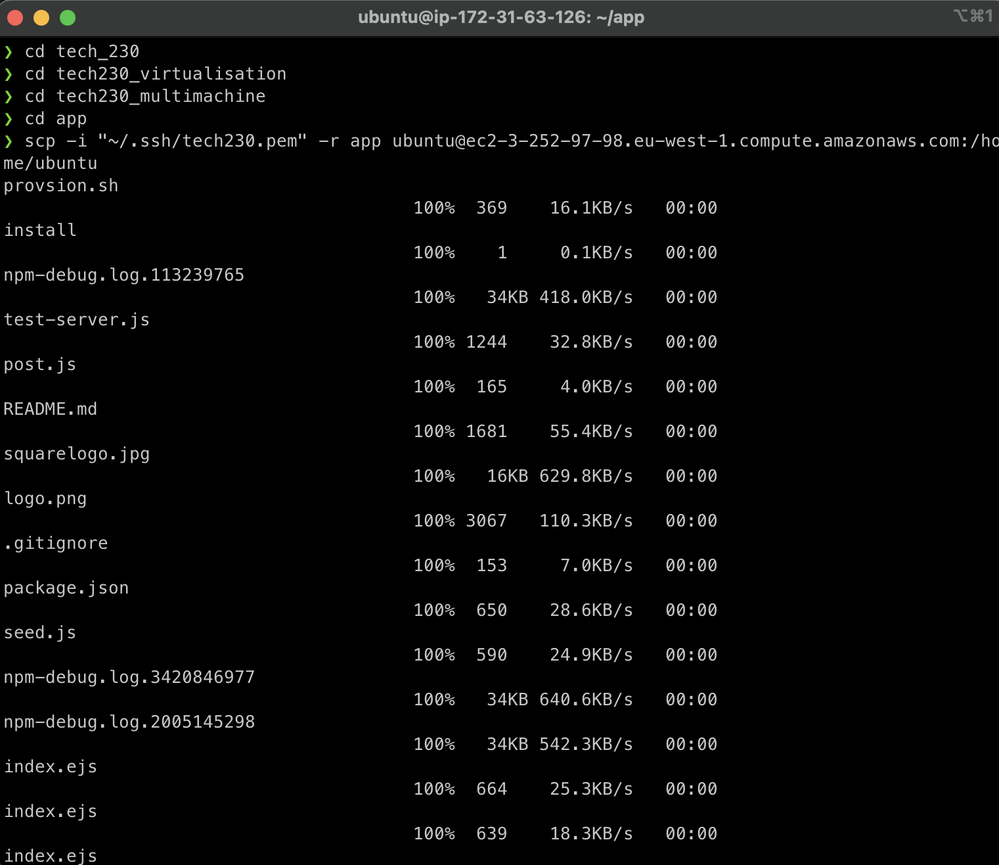

# A guide on how to create an EC2 instance in AWS, make AMI and have mongoDB installed

# AWS EC2 setup

1. Login to AWS using your `Username` and `Password`. Your screen should look like this:

2. Make sure your location appears as `Ireland` as it appears on the top irght hand corner in the picture above.
3. In the search bar, search for `EC2` and click the option as shown below:

4. Click on `Launch Instance`. This should look like this:

5. Name and tags - Name your instance using the appropriate format e.g. `tech230_name_first_ec2`.

6. Application & OS Images - Select your system as `ubuntu`. from the options shown and change your server to `20.04` and make sure it's `free tier eligible` as shown below:

This option should look like this:

7. Instance type - Select your instance type as `t2.micro` and again make sure it's `free tier eligible`
8. Name your key pair option as `tech_230`
9. Network Settings - Nothing to be changed here except select existing security group as shown below:

11. Configure Storage - Nothing to be changed here
12. Advanced details - Scroll down to `userdata` and add following script as shown in the picture below to install nginx.

12. Select `launch instance` on the screen to launch your instance

## Now that your instance is created, you'll need to connect using a SSH connection

1. In terminal, run `chmod 400 tech230.pem` - To make tech30 key read only
2. Run the command provided by AWS when you click 'Connect'. It should look like this:
   `ssh -i "tech230.pem" ubuntu@ec2-52-19-32-215.eu-west-1.compute.amazonaws.com`.

3. Copy Public IPv4 from your Instance summary in AWS (shown below) and paste this in the web browser

4. Nginx Live Server

### Note: If you did not complete `Step 12` in the above section, you'll need to setup nginx manually (refer to Setup NGINX server section in this readme file)

## Setup NGINX server (manually)

1. Run the following commands in this order:

`sudo apt update -y`
`sudo apt upgrade -y`
`sudo apt install nginx -y`
`sudo systemctl start nginx`
`sudo systemctl enable nginx`
`sudo systemctl status nginx`

2. Change security group to add a new rule to allow HTTP/S in addition to SSH so we are able to access our nginx server using public IP.

3. Copy and paste the public IPv4 address in your web browser, you can view this on the page as shown below:

## MongoDB installation

Now that nginx server is live, Follow the steps below to install mongodb:

Run the following commands in order.

- `sudo apt-get update -y`
- `sudo apt-get upgrade -y`
- `sudo apt-key adv --keyserver hkp://keyserver.ubuntu.com:80 --recv D68FA50FEA312927`
- `sudo apt-get install -y mongodb`
- `sudo systemctl start mongodb`
- `sudo systemctl enable mongodb`

Your EC2 connection in terminal should now look like this:

## Creating and Launching AMI

1. Select your newly created instance, Go to Actions and select the option as shown below:

2. A template will load to name your ami name (should look like below):

3. Scroll down to Advanced Settings and in your existing user data add the following script and click create templated:

- #!/bin/bash
- `sudo apt-get update -y`
- `sudo apt-get upgrade -y`
- `sudo apt-key adv --keyserver hkp://keyserver.ubuntu.com:80 --recv D68FA50FEA312927`
- `sudo apt-get install -y mongodb`
- `sudo systemctl start mongodb`
- `sudo systemctl enable mongodb`

4. No other settings need changing so you can go ahead and click `Create Launch Template`
5. Once the AMI is created, go to your original instance and terminate the ec2 running
6. Once your template is created, you can launch from the following dropdown option:

7. Once your instance is created from the template, wait for it to initialize and complete all necessary checks as follows:

8. Click on the instance ID, click Connect and follow the steps as shown below:

9. In terminal, `cd` into `.ssh` and run the following command to connect to your instance:
   `ssh -i "tech230.pem" ubuntu@ec2-3-252-97-98.eu-west-1.compute.amazonaws.com`

10. Now run `sudo systemctl status mongodb` and you should get the following output confirming your database is active (running):

## Deploying the Sparta App

Now that the mongodb is active within our instance, we can go ahead and deploy the sparta app following the steps as follows:

1. In terminal, Go to the directory containing the `app` folder and enter the follwing command:

`scp -i "~/.ssh/tech230.pem" -r app ubuntu@ec2-3-252-97-98.eu-west-1.compute.amazonaws.com:/home/ubuntu`

This will copy all the required files to deploy the app to our instance. Please note your ec2 address will look different based on your SSH connection.

Your terminal should look like this:

2. Now that app has been copied into our instance, follow appropriate steps to create a SSH connection in the terminal and run the following commands once you have entered the instance:

- `curl -sL https://deb.nodesource.com/setup_6.x | sudo -E bash -`
- `sudo apt-get install nodejs -y`
- `npm install pm2 -g`
- `npm install`
- `node app.js`

Your terminal should look like below at this point:

3. The app is now live but to be able to view it using our Public IPv4 address we need add a new inbound rule to our security group that allows the instance access to port 3000. To do this go to 'security' tab in your instance and click on the security group for this instance. It should look like this:

4. After clicking on the security group as seen above, select 'Edit Inbound Rules' and following screen should load where you can add the rule as seen below:

5. Our app is now deployed and we can view this by copying the Public IPv4 address and adding so it looks like this:

In web browser, enter: `http://3.252.97.98:3000/`

Deployed app looks like this:

