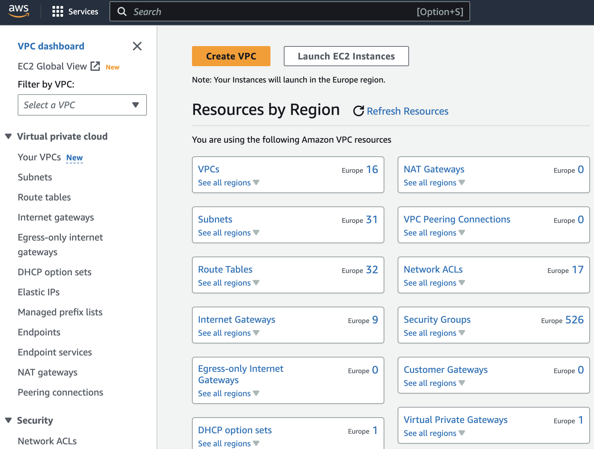
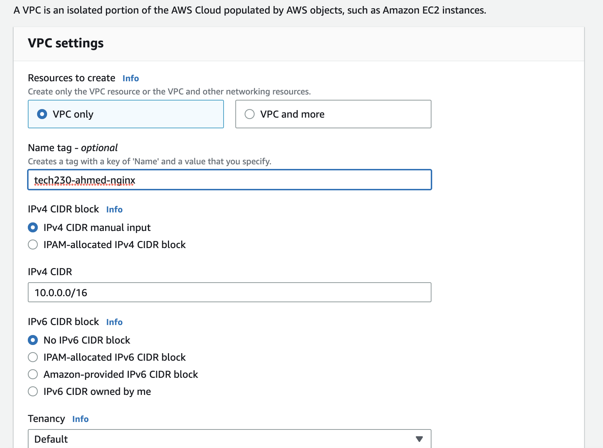
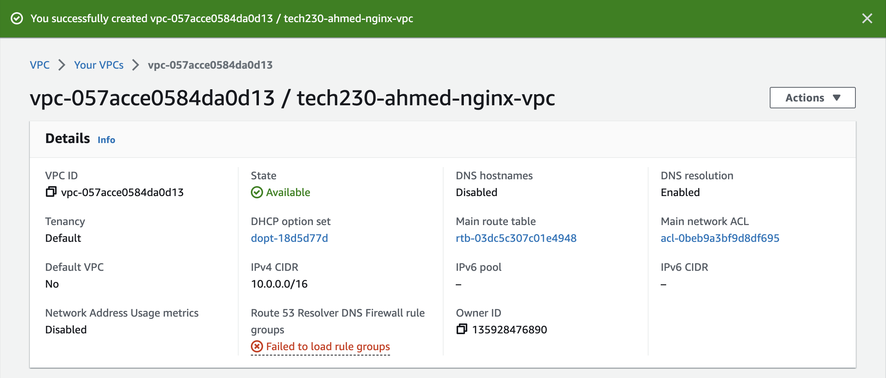
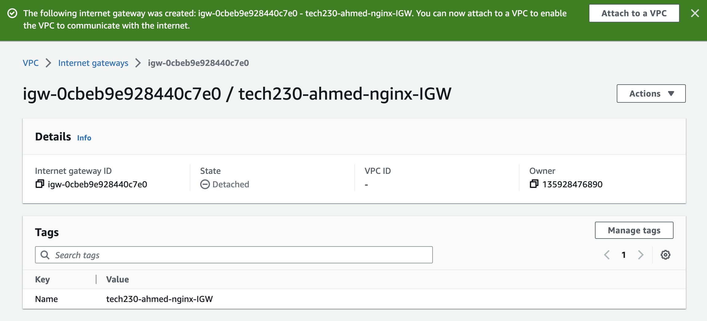
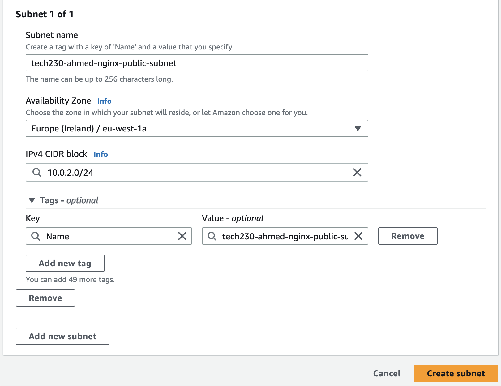
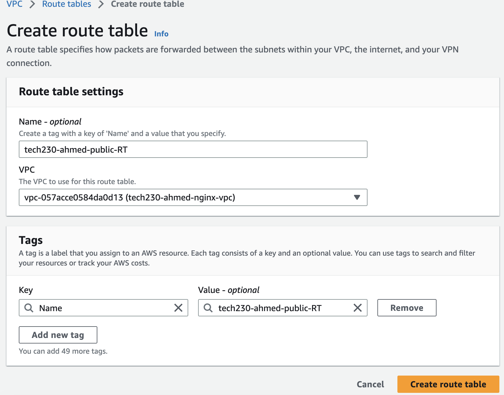
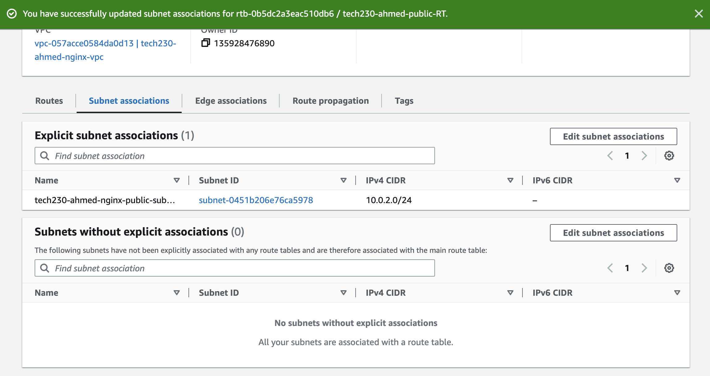
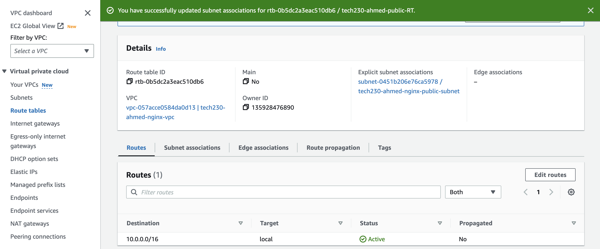

# VPC's in AWS

## What are VPC's

An Amazon VPC is an isolated portion of the AWS cloud. You use Amazon VPC to create a virtual network
topology for your Amazon EC2 resources.
You have complete control over your virtual networking environment, including selection of your own IP address range,creation of subnets, and configuration of route tables and network gateways.

In this file, we'll learn how to create a VPC (Virtual Private Cloud), Internet Gateway, Create a connection between the two, Public subnet and Route Tables.

## Creating a VPC

1. In AWS search bar, search for VPC's and select the first result. You should see a options like below on the next screen:

2. Select `Create VPC` which will take you to select your VPC settings. Select your resource as `VPC only` as you'll be creating the subnets etc separately later. Name your VPC approrpiately and enter `10.0.0.0/16` in `IPv4 CIDR block`. Note: `IPv6 CIDR block` is not required as we will only be working with IPv4. Your screen should look similar to below:

3. Click `Create VPC` and you should get a confirmation like below that you have succesfully created a VPC.

## Creating Internet Gateway

1. On the menu shown on the left hand side, select `Internet Gateways` and click on `Create Internet Gateway`
2. Name your `Internet Gateway` within the Internet Gateway settings and click 'Create Gateway'.
3. You should get confirmation like below to confirm you have successfully created an Internet Gateway:

## Connecting Internet Gateway and VPC

Now we need to connect our newly created VPC and Internet Gateway. To do this simply click `Attach to VPC` from the confirmation you see for Internet Gateway and select the VPC just created.

## Creating Subnet (Public)

1. On the menu shown on the left hand side, select `Subnets` and click on `Create subnet`
2. You'll be prompted to select a VPC first before subnet settings so select the recent VPC created by name.
3. Name your subnet in subnet settings, select prefferred availability zone as appropriate and enter `10.0.2.0/24` in the `IPv4 CIDR block`.
4. A name tag should have appeared below based on how you have named your subnet. To confirm, click `create subnet` and your subnet should be created.

## Creating Route Table

1. Select `Route Table` from the left hand side menu and click `Create route table`
2. You'll be prompted to name your route table and select VPC (this will be the one you just created). Route table settings look like this:

3. A name tag will be created below and now you can click `Create route table` to confirm. Confirmation should look like this:

## Connecting Subnet to a route table

As seen in the picture above, there is a Subnet appearing in the `Explicit subnet associations` confirming that our route table is connected to a subnet. However, if that was not the case we would see it appear in the `Subnets without explicit asociations`. In this case, we would click on `Edit subnet associations` and add our subnet manually. A confirmation message should appear once it is added(after you can confirm by checking your subnet has moved from unassociated to associated subnets):

Each subnet in your VPC must be connected to a route table. A route table contains a set of rules, called routes, that determine where network traffic from your subnet or gateway is directed.

## Connecting Internet Gateway to the Route Table

now we need to connect internet gateway to the route table - within routes, select edit routes. select add route and choose the 1 with all 0's (it allows traffic from anywhere). In target select internet gateway. select the internet gateway that pops up. click save changes.

route table is automatically setup for us for the db and app machine to connect

go to instances ec2 - select launch instance and name tech230-ahmed-nginx-in-vpc / or you can also use an existing ec2

In netwrok setting when creating ec2, sleect existing securtiy group. change austo-assign public IP to ENABLE. click edit in network settings and select a vpc you just created. `existng security grups will not work with new vpc`. clcik create new security group, give description, select add security group rules for http, ssh and custom(3000).

in advanced details,go to user data, paste nginx commands
