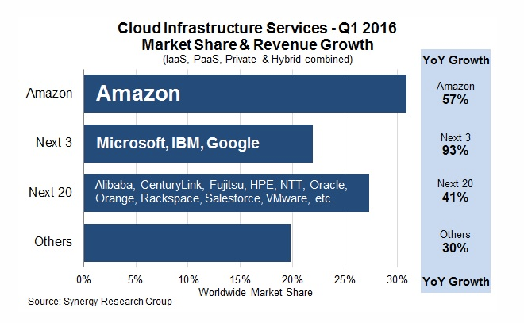
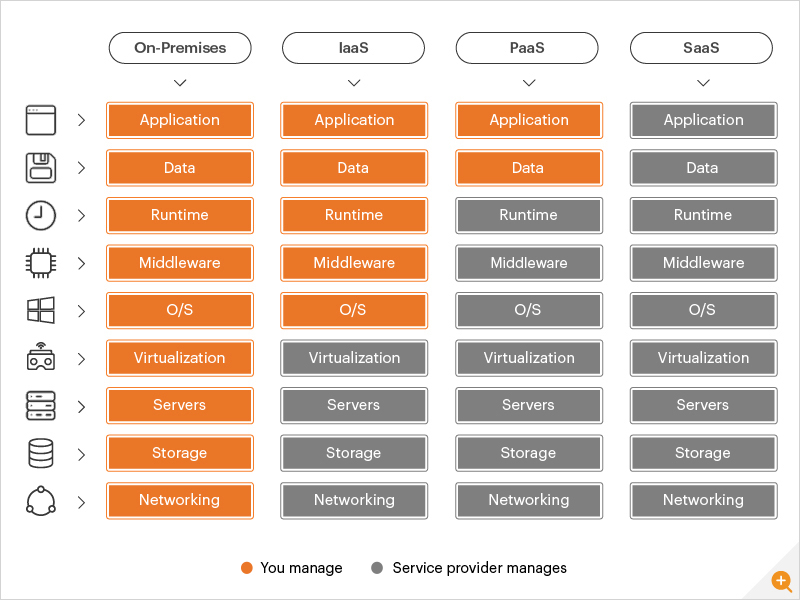
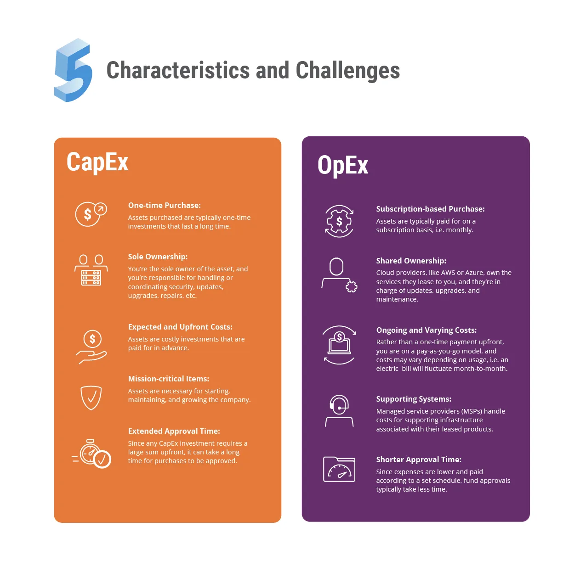

# All Things Cloud Computing & AWS

## What is cloud computing

- On-demand delivery of IT resources
- Access technology services e.g. computing power, storage and databases
- Pay as you go structure

## History of Cloud Computing

The History of Cloud Computing started in the early 1960s. During this period the concepts of time-sharing took a rise via Remote Job Entry. This terminology was associated with IBM and DEC (Digital Equipment Corporation). Due to this growth, full time-sharing systems were available by the early 1970s. By the 1990’s, few telecommunication giants started offering VPN (Virtual private network) services at affordable costs. As they could do by switching traffic with proper server use, it made them use the overall network more effectively. By 1994, the cloud metaphor was started to be used for virtualized services.

## What are the benefits of cloud computing

1. Agility:

- Easy access means faster innovation
- Quick resource setup
- Deployment of technologies within minutes
- Freedom to experiment and test new ideas

2. Elasticity:

- No over-provisioning - access resource as you need them

3. Cost savings:

- Fixed expenses to lower variable expenses for data centers / physcial servers
- Pay for IT as you consume it

4. Deploy globally in minutes:

- Expand to new geographic regions
- Deploy application in multiple physical locations with just a few clicks
- Closer proxmity to user reduces latency

## What are the main benefits of cloud computing for a business

1. Cost Savings
2. Security
3. Flexibility
4. Mobility
5. Insight
6. Increased Collaboration
7. Quality Control
8. Disaster Recovery
9. Loss Prevention
10. Automatic Software Updates
11. Competitive Edge
12. Sustainability

## What is AWS

AWS is world's leading, most comprehensive and broadly adopted cloud, offering over 200 fully featured services from data centers globally. Millions of customers—including the fastest-growing startups, largest enterprises, and leading government agencies—are using AWS to lower costs, become more agile, and innovate faster.

## History of AWS

There are lots of stories about the formation of AWS, but this much we know: 10 years ago, Amazon Web Services, the cloud Infrastructure as a Service arm of Amazon.com, was launched with little fanfare as a side business for Amazon.com. Today, it’s a highly successful company in its own right, riding a remarkable $10 billion run rate.

In fact, according to data from Synergy Research, in the decade since its launch, AWS has grown into the most successful cloud infrastructure company on the planet, garnering more than 30 percent of the market. That’s more than its three closest rivals — Microsoft, IBM and Google — combined (and by a fair margin).

## Other main cloud providers

- Microsoft
- IBM
- Google

Others include Alibaba, CenturyLink, Fujitsu, HPE, NTT, Oracle, Orange, Rackspace Salesforce, VMware, etc.

## What is IaaS, PaaS and SaaS. Make a diagram

## Public cloud v Hybrid cloud v Private cloud

### Private Cloud:

- Sometimes referred to as a data center - reside on a company’s own infrastructure, typically firewall protected and physically secured. Mature organizations that have heavily invested in on-premises infrastructure frequently leverage that investment to create their private cloud. Although this offers a big financial benefit private clouds must still be supported, managed, and eventually upgraded or replaced. The onus for security in a private cloud falls squarely on the organization’s shoulders, from physical security to encryption to network and cybersecurity. Since private clouds are typically owned by the organization, there is no sharing of infrastructure, no multitenancy issues, and zero latency for local applications and users.

### Public Cloud:

- Public clouds alleviate the responsibility for management of the infrastructure since they are by definition hosted by a public cloud provider such as AWS, Azure, or Google Cloud. In and infrastructure-as-a-service (IaaS) public cloud deployment, enterprise data and application code reside on the cloud service provider (CSP) servers, which can be shared in a multi-tenant environment with other organizations’ IT resources. Typical use cases for public clouds are as a backup and archival medium for enterprise data, to support business continuity initiatives, offloading front-end web applications to lower latency to global users, and to support ‘cloudbursting’ of IT resources so that when demand for a particular application increases additional instances of that application can be rapidly spun up at the CSP, eliminating the need for a business to over-provision their on-premises infrastructure to handle sudden spikes in demand. Although the physical security of hyperscale cloud providers such as AWS is unmatched, there is a shared responsibility model that requires organizations that subscribe to those cloud services to ensure their applications and network are secure, for example by monitoring packets for malware or providing encryption of data at rest and in motion.

### Hybrid Cloud:

- Hybrid cloud refers to a mixed computing, storage, and services environment made up of on-premises infrastructure, private cloud services, and a public cloud—such as Amazon Web Services (AWS) or Microsoft Azure—with orchestration among the various platforms. Using a combination of public clouds, on-premises computing, and private clouds in your data center means that you have a hybrid cloud infrastructure.

## What types of industry/business use the different types of cloud? (who used private)

Here is a look at some of the indutries that use cloud effectivey and how they benefit from the technology.

Agriculture:

- Modernised Processing
- Essential data management
- Cost and resource effeciency

Air Transport:

- Better service
- Aircraft maintenance
- Reduced carbon footprint

Automative:

- Improved suply chain operations
- Streamlined sales
- Better user experience

Education:

- Improved accessibility
- Fostering collaboration
- Lower costs

Finance:

- Resilient security
- Improved mobility
- Data aggregation and storage

Gaming:

- Scaling on traffic
- Increased compatibility
- Global accessibility

Healthcare:

- Stronger collaboration
- Agile scalability
- Cost reduction

Hospitality:

- Improved guest experience
- Lowered operational expenses
- Flexibility and security

Manufacturing:

- Effecient data management
- On-demand delivery
- Automation & Innovation

Streaming:

- Agile scaling
- Better data storage
- Improved user experience

## What is operating expenditure and what is Capital expenditure (Ca?pEx)

Difference between Capital Expenditure & Operating Expenditure:

## What is preferable and how does the cloud allow businesses to transfer to spending more on the preferred one?

Cloud can be CapEx or OpEx depending on the types of investments and cloud environment. Cloud can be considered CapEx when large one-time purchases are made for fixed assets, like infrastructure for an on-premises data center. On the other hand, cloud can be OpEx when costs are tied to day-to-day operations, like a monthly cloud-based application subscription.

- Cloud allows businesses to shift their IT expenses from CapEx to Opex by removing major upfront costs and replacing them with manageable, more consistent monthly or annual fees.
- By offloading the headache of CapEx infrastructure investment and maintenance to third party providers, IT teams have extra time and budget to focus on activities that bring value to the business like building new products and investigating innovative solutions

## Case studies on companies that have transferred to the cloud and what that has allows them to do? 1-3 recommended.

- TransferWise:

Keeping pace with its growth was challenging because TransferWise hosted its application environments in on-premises data centers that made it difficult to scale and ensure the constant availability customers expect.
To solve its global growth challenge, the company chose to migrate to Amazon Web Services (AWS).
TransferWise began its cloud migration by using a hybrid cloud storage architecture to move its data backup environment to AWS. The company shifted all its backups to AWS using AWS Storage Gateway, a hybrid cloud storage service that provides on-premises access to cloud storage.
Once the company’s databases were being backed up to AWS, TransferWise began to use those backups to migrate its databases. The organization migrated 90 percent of its German data center using this approach.

Transferring to cloud has allows tranferWise to:

1. Streamline Storage Management - The organization also uses AWS Backup to automate and manage backup operations.
2. Scaling Quickly to Support Tenfold Business Growth - Instead of being constrained by an on-premises infrastructure, TransferWise can now scale its web and mobile application platform easily to keep pace with tenfold annual growth.
3. Launching New Products Globally - Taking advantage of the scalability, agility, and availability of AWS, TransferWise can better support innovation.
