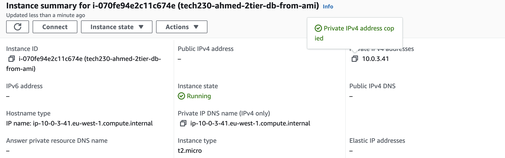

# How to deploy 2 tier architecture within AWS VPC's

In order to deploy a 2-tier architechture within a VPC, we will need to have two virtual machines on AWS. One of these would be for the database and the other to actually run the app. But before we look creating these virtual machines we need to

we need to cover a few steps such as below:

1. Creating a VPC
2. Creating an Internet Gateway
3. Attaching VPC to Internet Gateway
4. Creating a Public and Private Subnet
5. Creating Route Tables
6. Connecting Subnet to Route Table
7. Connecting Internet Gateway to Route Table
8. Creating EC2 Instances within the VPC

To complete steps 1-7, you can follow the guide [here](./aws-vpc.md)

To create EC2 Instances within the VPC, follow the steps below:

### To create Database EC2

1. We need to first create our db instance within the private subnet of our VPC, To do this we do `Launch Instances` and name our instance appropriately. In this case, we have named it `tech230-ahmed-2tier-db-from-ami`

2. Select an AMI that we have tested before using our db script so we know mongoDB works and connects without any blockers, You can select the correct AMI like this:

3. Make sure your instance has correct instance type (`t2.micro`) and correct key pair login:

4. Within `Network Settings`, change the VPC to the one we have created and make sure that the subnet we have selected is a `private subnet`. This is to make sure our database is only accessed by the App virtual machine and not the public.

5. Now we need to create a security group to effectively form a firewall that will allow us to control the incoming traffic, for example we don't want the public to be able to SSH into our database so we would select our `source type` as `My IP` for security group rule 1. However, for rule 2, MongodDB default port is `27017` so we can allows access through that from anywhere. This should look like below:

6. We dont need to input any `user data` because our instance is created from an AMI where we've previously saved our script and all the commands we need to run for our database. We've manually tested it so we know it works.

### To create App EC2

1. We need to create our app virtual machine within the public subnet of our VPC because we want the public to be able to access and see what we've made, To do this we click on `Launch Instances` and name our instance appropriately. In this case, we have named it `tech230-ahmed-2tier-app-from-ami`.

2. For our AMI, we can just use Ubuntu 20.04 version that we have tested and we know it works. It should look like this:

3. Just like above in db instance, we need to ensure our key pair (`tech230`) and instance type (`t2.micro`) is correct.

4. Within `Network Settings`, change the VPC to the one we have created and make sure that the subnet we have selected is a `public subnet`. This is to make sure our app can be accessed by the public.

5. Now we need to create a security group to effectively control how our app is accessed by the public and using which ports, again we need to make sure SSH connection is only through our own IP but HTTP connection can be from anywhere, Inbound rules should look like this:

6. For our app, we do need some user data because our script needs to include the private ip address we get once our database virtual machine runs, essentially allowing the two to speak to each other and display the contents on our webpage. we first obtain the private IP from db instance as shown below and then paste it into our user data in the second image (as you can see they match in both screenshots):

### Now we can launch our App instance as well, our Database instance is already running so we just check if everything is working

1. Grab the public IP from the App VM (as shown below and paste it in the web browser). NOTE: This can take a few minutes to load the contents so keep refreshing. Your output if everything has worked should look like this:

2. If we add `/posts` at the end of our IP, we can also view the posts page working correctly. see below:

